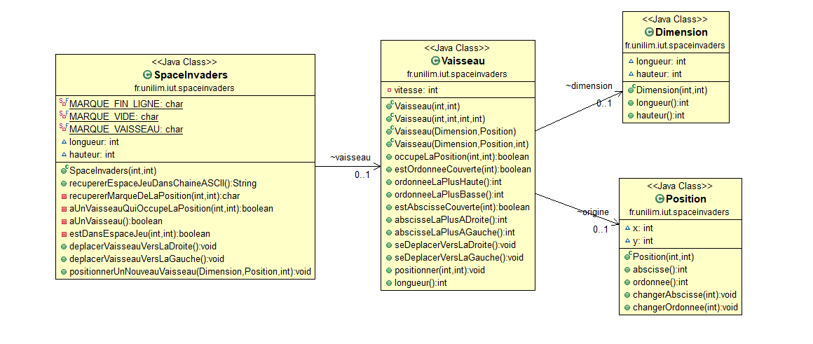
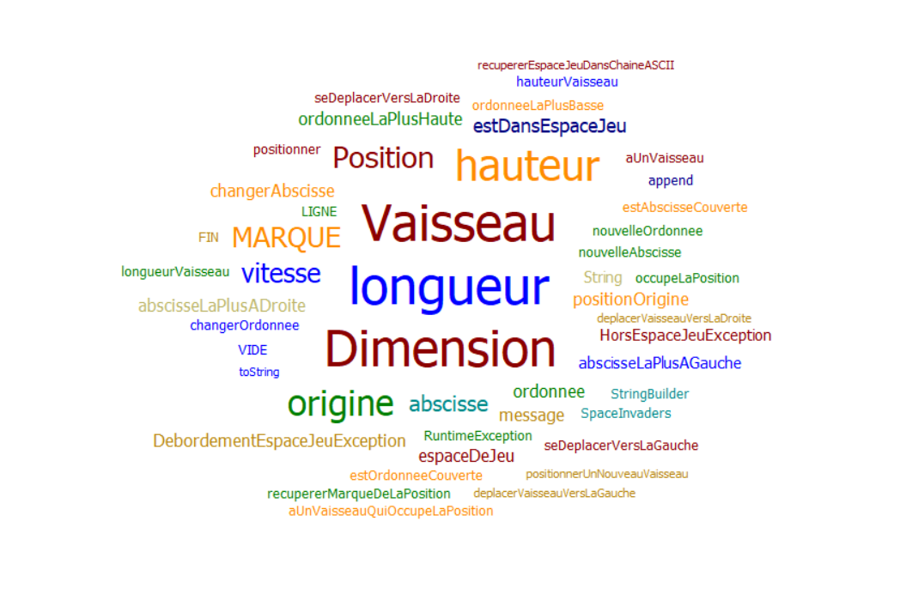
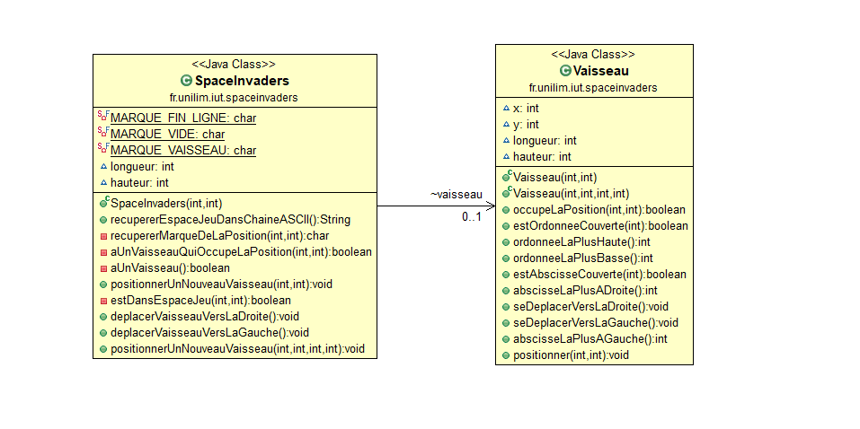
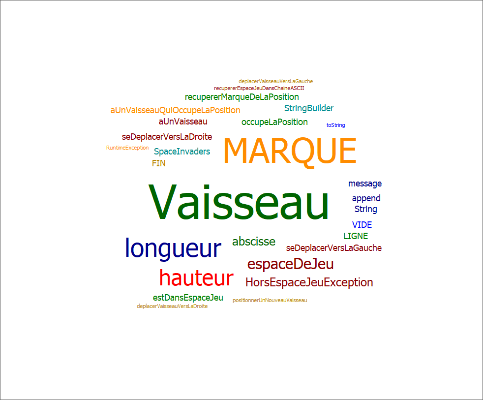
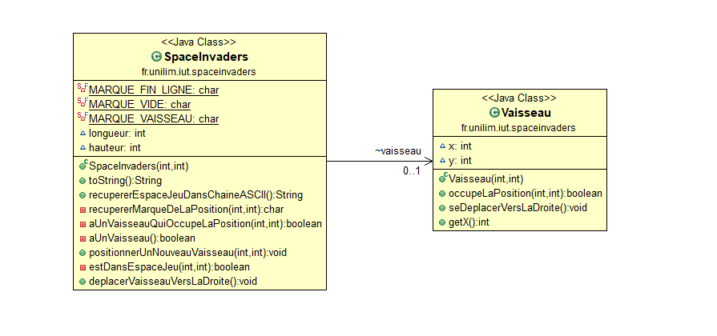
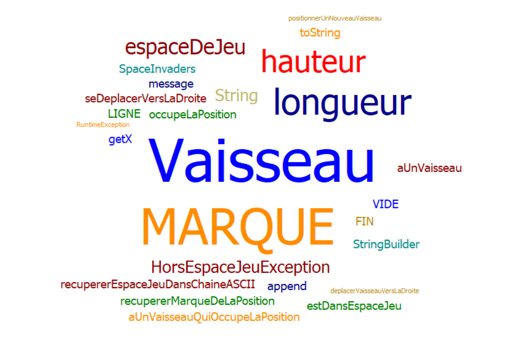

# Semaine n°4 : du 17 mai au 21 mai 
## Sprints et fonctionnalités réalisées
Fonctionnalité n°3 : Choisir la vitesse du vaisseau

Story n°1 :Ajouter la vitesse au Vaisseau sans régression de comportement(fini)
Le vaisseau a maintenant un nouvel attribut nommé vitesse qui doit pouvoir être modifiable durant la partie et différent d'un vaisseau à l'autre.

Story n°2 : Faire en sorte que le déplacement se fasse correctement pour une vitesse quelconque (en cours)
Savoir envisager les cas ou le changement de vitesse posera problème. il est impératif de changer le fonctionnement des deux déplacements actuels (le déplacement vers la droite et vers la gauche). Nous devons modifier la plupart des méthodes et créer de nouveaux tests spécifiques.

Fonctionnalité en cours d’implémentation :
Etape n°2 : Déplacement vers la gauche pour une vitesse quelconque

### Nuage de mots de la semaine 3

Difficultés rencontrées
Il y a eu un melange entre les axes x et y qui a posé problème lors de la session précédente, Cela peut être la source de petites erreurs pour les prochaines fois!

Remarques diverses
Aucune

------

Glossaire

_Vaisseau_ : véhicule commandé par le joueur, pouvant se déplacer de droite à gauche et ayant la possibilité de lancer des missiles destinés à détruire le(s) envahisseurs.
_Vitesse_ : Nombre de sections parcourues en 1 déplacement sur l'axe x ou y.

----------------
# Semaine n°3 : du 10 mai au 14 mai 
## Sprints et fonctionnalités réalisées
Fonctionnalité n°2 : Dimensionner le vaiseau

Story n°1 : POuvoir donner une dimension au vaisseau (fini)
Le vaisseau doit avoir un nouveau constructeur qui lui permet d'avoir une dimension en plus de sa position.

Story n°2 : Modifier les les méthodes et tests qui ont besoin de la dimension du vaisseau (fini)
Les constructeurs ont été modifiés, nous devons donc vérifier que les différentes méthodes peuvent être utilisées correctement avec les nouveaux constructeurs. De plus, nous allons faire de étapes de "Refractoring" supplémentaire afin de vraiment pouvoir naviguer dans le code et de le comprendre sans avoir des commentaires à toutes les lignes.

Fonctionnalité en cours d’implémentation :
Etape n°2 : Faire en sorte qu'il soit impossible de positionner un nouveau vaisseau qui déborde de l'espace de jeu

### Nuage de mots de la semaine 2

Difficultés rencontrées
Aucune

Remarques diverses
Aucune

------

Glossaire

_Vaisseau_ : véhicule commandé par le joueur, pouvant se déplacer de droite à gauche et ayant la possibilité de lancer des missiles destinés à détruire le(s) envahisseurs.

----------------

# Semaine n°2 : du 26 avril au 2 mai 
## Sprints et fonctionnalités réalisées

Fonctionnalité n°1 : Déplacer un vaisseau dans l'espace de jeu (fini)

Story n°1 : Créer un espace de jeu (fini)
Un espace de jeu est créé aux dimensions données (2D) Cet espace de jeu est vide

Story n°2 : Positionner un nouveau vaisseau dans l’espace de jeu (fini)
Un nouveau vaisseau est créé Le vaisseau est positionné aux coordonnées transmises Si un nouveau vaisseau essaye d’être positionné en dehors des limites de l’espace jeu, alors une exception devra être levée. Contraintes : La position souhaitée est transmise par ses coordonnées x et y. Le coin supérieur gauche de l’espace jeu (point en haut à gauche) a pour coordonnées (0,0) La taille du vaisseau est réduite pour l'instant à son minimum (1 seul point)

Story n°3 : Déplacer le vaisseau vers la droite dans l'espace de jeu (fini)
Le vaisseau se déplace d'un pas vers la droite Si le vaisseau se trouve sur la bordure droite de l'espace de jeu, le vaisseau doit rester immobile (aucun déplacement, aucune exception levée : le vaisseau reste juste à sa position actuelle).

Story n°4 : Déplacer le vaisseau vers la gauche dans l'espace de jeu
Le vaisseau se déplace d'un pas vers la gauche Si le vaisseau se trouve sur la bordure gauche de l'espace de jeu, le vaisseau doit rester immobile (aucun déplacement, aucune exception levée : le vaisseau reste juste à sa position actuelle).

Fonctionnalité en cours d’implémentation :
Aucune

### Diagramme de classes

### Nuage de mots de la semaine 1

Difficultés rencontrées
Certains test furent particulièrement ennuyeux mais j'ai réglé le problème.

Remarques diverses
Aucune

------

Glossaire

_Vaisseau_ : véhicule commandé par le joueur, pouvant se déplacer de droite à gauche et ayant la possibilité de lancer des missiles destinés à détruire le(s) envahisseurs.
